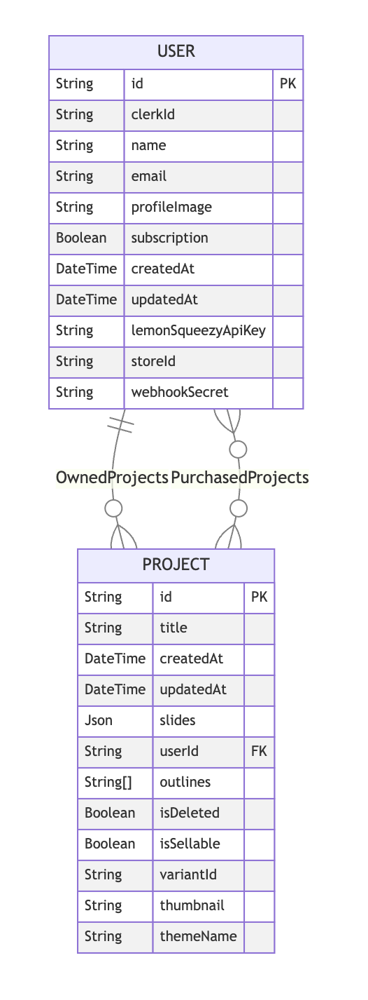

This is a [Next.js](https://nextjs.org) project bootstrapped with [`create-next-app`](https://nextjs.org/docs/app/api-reference/cli/create-next-app).

## Getting Started

First, run the development server:

```bash
npm run dev
# or
yarn dev
# or
pnpm dev
# or
bun dev
```

Open [http://localhost:3000](http://localhost:3000) with your browser to see the result.

You can start editing the page by modifying `app/page.tsx`. The page auto-updates as you edit the file.

This project uses [`next/font`](https://nextjs.org/docs/app/building-your-application/optimizing/fonts) to automatically optimize and load [Geist](https://vercel.com/font), a new font family for Vercel.

## Learn More

To learn more about Next.js, take a look at the following resources:

- [Next.js Documentation](https://nextjs.org/docs) - learn about Next.js features and API.
- [Learn Next.js](https://nextjs.org/learn) - an interactive Next.js tutorial.

You can check out [the Next.js GitHub repository](https://github.com/vercel/next.js) - your feedback and contributions are welcome!

## Deploy on Vercel

The easiest way to deploy your Next.js app is to use the [Vercel Platform](https://vercel.com/new?utm_medium=default-template&filter=next.js&utm_source=create-next-app&utm_campaign=create-next-app-readme) from the creators of Next.js.

Check out our [Next.js deployment documentation](https://nextjs.org/docs/app/building-your-application/deploying) for more details.

# Documentation

1. Create Project

```bash
bunx create-next-app@15.3.0 .
```

2. create env and initate all service api variables

3. initialize shadcn

```bash
bunx --bun shadcn@latest init
```

4. add all shadcn components

```bash
bunx --bun shadcn@latest add -a
```

5. initialize project folder for later

```bash
cd src
mkdir actions provider store icons
```

6. initialize global atomic folder for shadcn

```bash
cd src/components
mkdir global
```

7. add dark mode from shadcn

```bash
cd ../..
bun add next-themes
```

8. making the darkmode componentn inside src/provider/theme-provider.tsx

```bash
touch src/provider/theme-provider.tsx
```

9. Wrap Dark Mode Provider in Layout

```jsx
<ThemeProvider
  attribute={'class'}
  defaultTheme="dark"
  enableSystem
  disableTransitionOnChange
>
  {children}
  <Toaster position="top-right" richColors />
</ThemeProvider>
```

also adding supress hidration warning caused by clerk

```jsx
suppressHydrationWarning
```

10. Update global css, shadcn component and also page and text

11. add clerk provider into system for user management

```bash
bun add @clerk/nextjs --force
```

then add the middleware.ts for the middle provider, the main function is to protect some route, need to login first. so the user can access it. but we add a little logic for conditional, if the url is public, then dont force to login first. in detail the route /sign-in and /sign-up is public. end then if the route is not public and user not auth, it will redirect into public route, which is /sign-in or /sign-up

12. wire up the clerk by wrapping entire app layout into clerk provider component

```jsx
<ClerkProvider
  appearance={{
    theme: dark,
  }}
>
  ...
</ClerkProvider>
```

13. directing clerk auth into our own route which is sign-in and sign-up folder

```jsx
const isPublicRoute = createRouteMatcher([
  '/sign-in(.*)',
  '/sign-up(.*)',
  '/sso-callback(.*)',
])

export default clerkMiddleware(async (auth, req) => {
  if (!isPublicRoute(req)) {
    await auth.protect()
  }
})
```

14. adding simple layout for sign in / sign up page in (auth)/layout.tsx

15. adding prisma into our system for orm (object relational mapper), so we can talk to database with jvascript

```bash
bun add @prisma/client@5.22.0
```

16. create prima configuration in lib/prisma.ts

```jsx
import { PrismaClient } from '@prisma/client';

declare global {
    var prisma: PrismaClient | undefined;
}

export const client = global.prisma || new PrismaClient();

if (process.env.NODE_ENV !== 'production') globalThis.prisma = client;
```

basically what we want to do is to configure out prisma to have one connection only while development.

17. initialize prisma

```bash
bunx prisma init
```

this will genereate prisma/schema.prisma, what thats do is to configure the database provider, database url, model of our table and else.

18. Create neon database project, add the database url into env. end then generate prisma database initiator

```bash
bunx prisma generate
```

akan ada hasil generated folder di src, yang tujuannya adalah ya bikinin script mapper itu, yang bisa kita pake untuk panggil database atau lain lain hanya dengan bahasa javascirpt

19. singkronisasi prisma ke database tanpa migration

```bash
bunx prisma db push
```

disini prisma bakal baca schema.prisma, terus connect ke database dengan url dari env, terus buat table sesuai model di databae.

20. update database schema

- 

kira kira bentuknya kaya gitu lah ya. intinya kita punya dua table utama, user dan project, dan terhubung dengan dua jenis relasi, one to many by use <-> owned projects dan many to many by user <-> purchased project.

logikanya adalah user sebagai akun utama bisa buat project sendiri dan juga beli project dari orang lain, di lain sisi project adalah object presentasi itu punya pemilih tunggal, tapi bisa jga dimiliki oleh banyak pembeli.

setelah itu tinggal bunx prisma generate dan bunx prisma db push, dan we left with two database created in neon db dengan segala relasi dan logic yang kita set.

21. kita balik lagi ke sign in process. disini kita bakal nambah callback.

fungsi callback disini bisa dibilang kaya satpam, jadi pas user mau login di clerk, pas udah login, bakal ada route callback, which is disini itu tuh kaya checkpoitn aja, intinya, oke user udah login, sekarang kita mau mututsin si user ini udah baru daftar atau udah pernah daftar sebelumnya. kalo belum maka di daftar dulu datanta di database. abis itu baru dibawa ke dashboard. nah kalo si user itu loginnya ga valid maka dia bakal di suruh login ulang.

22. now we focus on building our dashboard ui,

first the page. the page will get all project by taking allproject function to retrieve all user project. maked or buyed

23. sidebar

we will create layout in protected folder that load layout component in pages/layout
